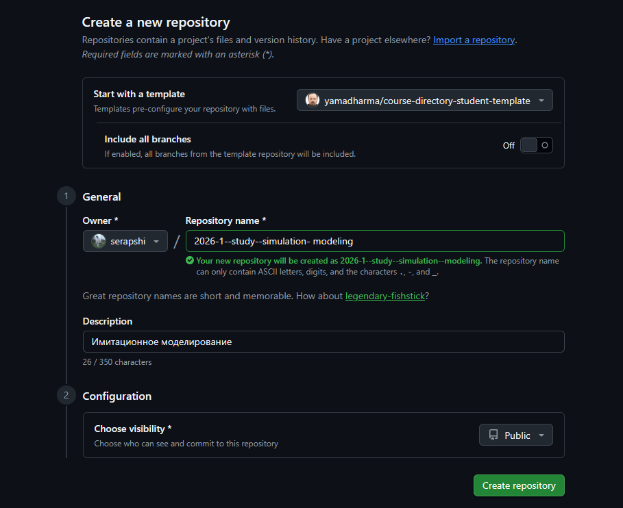
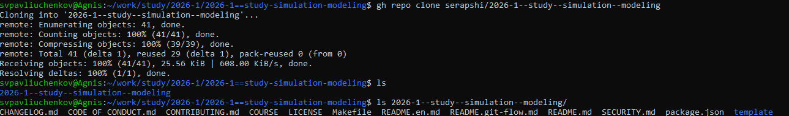
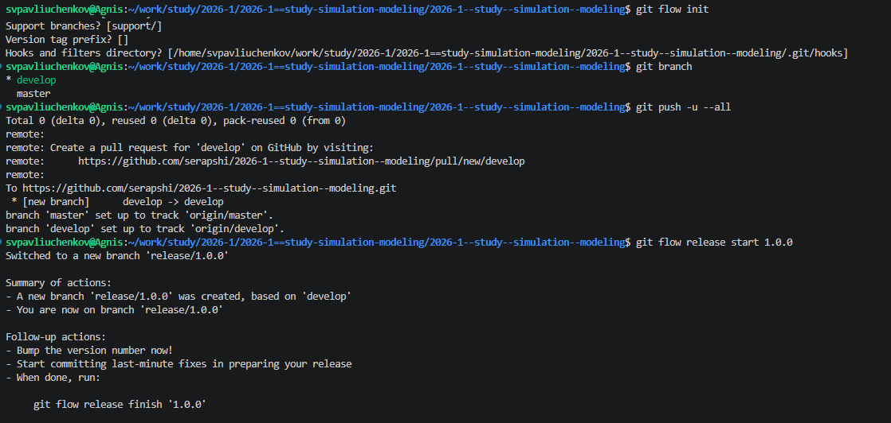
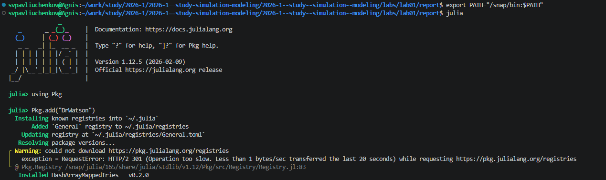
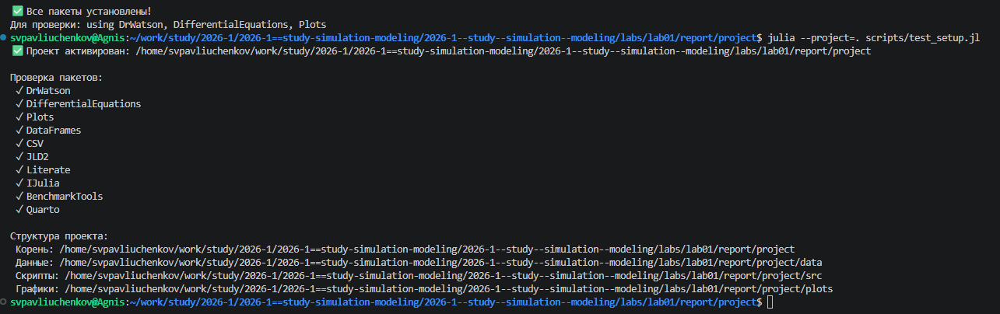

---
## Author
author:
  name: Сергей Витальевич Павлюченков
  email: 1132237372@rudn.ru
  affiliation:
    - name: Российский университет дружбы народов
      country: Российская Федерация
      postal-code: 117198
      city: Москва
      address: ул. Миклухо-Маклая, д. 6
## Title
title: Лабораторная работа №1
subtitle: Имитационное моделирование
license: CC BY
date: today
date-format: "YYYY-MM-DD" # Example: 2025-09-06
---

## Докладчик

:::::::::::::: {.columns align=center}
::: {.column width="70%"}

  * Павлюченков Сергей Витальевич
  * Студент группы НКНбд-01-23
  * Российский университет дружбы народов им. П. Лумумбы

:::
::: {.column width="30%"}

:::
::::::::::::::

# Вводная часть

## Цели и задачи

- Подготовить рабочее пространство для выполнения лабораторных работ
- Приобрести навыки создания и преобразования программ на Julia

## Задачи работы

- Создать каталог курса и рабочее пространство лабораторной работы
- Установить необходимые пакеты и программное обеспечение
- Выполнить предложенный код и преобразовать его в литературный стиль

## Инструменты и стандарты

- Git Flow для ветвления и выпусков
- Семантическое версионирование и Conventional Commits для истории изменений
- Denote для именования каталогов и файлов
- DrWatson.jl для организации проекта на Julia
- Literate.jl и Quarto для литературного программирования и отчётов

# Выполнение

## Рабочий каталог курса

- Репозиторий создан на основе шаблона курса
- Структура каталогов: `~/work/study/2026-1/…`, каталог лабораторной работы `labs/lab01`

{#fig-001 width=70%}

## Установка программного обеспечения

 - Установлены и проверены пакеты, необходимые для лабораторных работ - Добавлены `commitizen`, `cz-customizable` и `standard-version` для оформления коммитов и версий 
 {#fig-003 width=70%}

{#fig-002 width=70%}

## Git Flow

{#fig-004 width=60%}

## Проект DrWatson

- Каталог проекта создан скриптом `setup_project.jl`
- Пакеты добавлены скриптом `add_packages.jl`, структура проекта проверена

{#fig-005 width=70%}

## Проверка пакетов

{#fig-006 width=70%}

- Скрипт `01_exponential_growth.jl` оформлен в стиле Literate.jl: строки с `#` — Markdown, остальное — код Julia - Скрипт `tangle.jl` генерирует из одного исходника чистый код, Jupyter-ноутбук и документ Quarto

# Результаты

## Итоги выполнения

- Рабочее пространство курса и проект DrWatson созданы
- Необходимые пакеты установлены и проверены
- Код модели выполнен, преобразован в литературный стиль и сгенерирован в производные форматы

## Выводы

- Подготовлено рабочее пространство для выполнения программ
- Приобретены навыки создания и преобразования программ на Julia