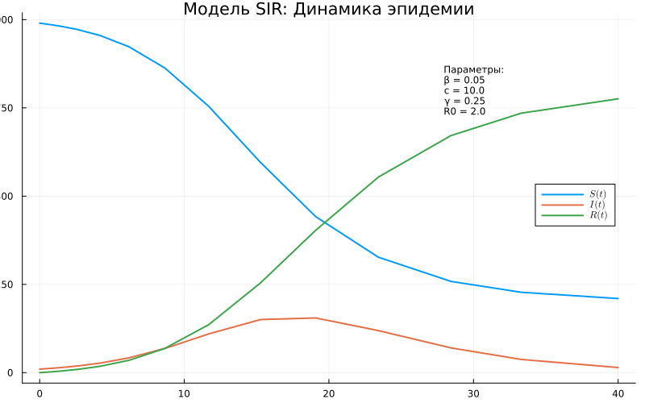
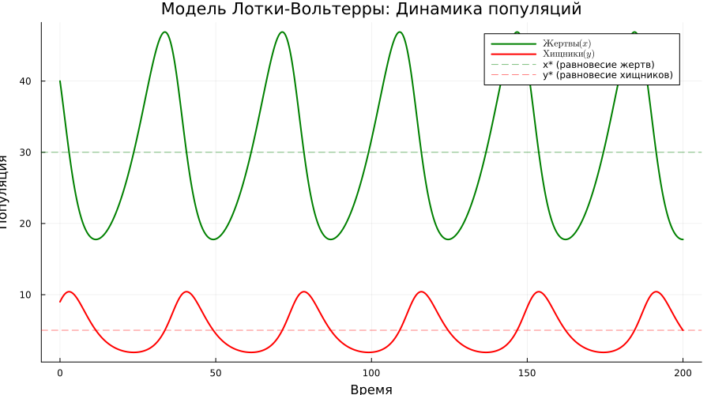
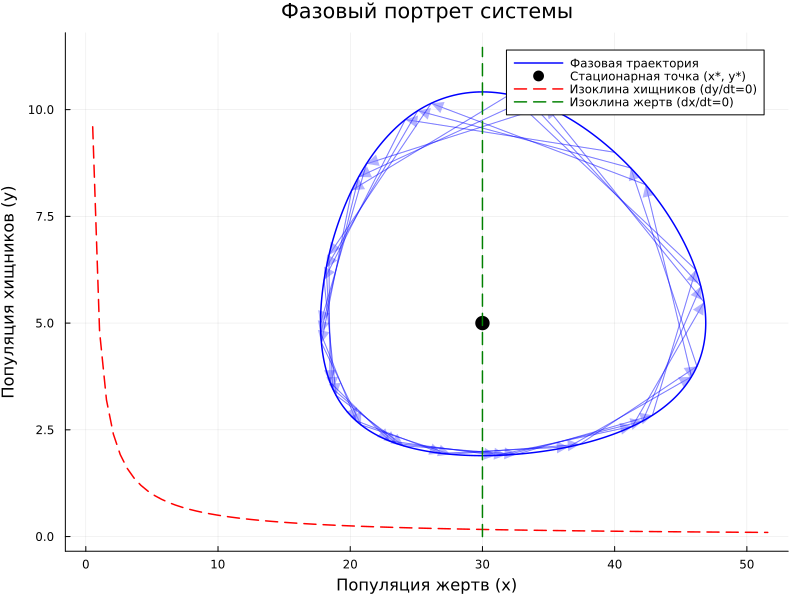

---
## Author
author:
  name: Сергей Витальевич Павлюченков
  email: 1132237372@rudn.ru
  affiliation:
    - name: Российский университет дружбы народов
      country: Российская Федерация
      postal-code: 117198
      city: Москва
      address: ул. Миклухо-Маклая, д. 6
## Title
title: Лабораторная работа №2
subtitle: Имитационное моделирование
license: CC BY
date: today
date-format: "YYYY-MM-DD" # Example: 2025-09-06
---

## Докладчик

:::::::::::::: {.columns align=center}
::: {.column width="70%"}

  * Павлюченков Сергей Витальевич
  * Российский университет дружбы народов им. П. Лумумбы

:::
::: {.column width="29%"}

:::
::::::::::::::

# Вводная часть

## Актуальность

- Модели SIR и Лотки–Вольтерры --- базовые модели эпидемиологии и экологии
- Позволяют понять динамику эпидемий и колебаний численности популяций

## Объект и предмет исследования

- Объект: динамика численности популяций и распространения инфекции
- Предмет: модели SIR и Лотки–Вольтерры и их программная реализация на Julia

## Цели и задачи

- Цель: изучить модели SIR и Лотки–Вольтерры и аспекты их программной реализации
- Задача: получить чистый код, Jupyter notebook и Quarto-документ из литературного кода

## Материалы и методы

- Язык Julia, пакеты DrWatson, DifferentialEquations, Plots
- Литературное программирование: Literate.jl
- Результаты: скрипты, notebook, Quarto-документ, графики

# Результаты

## Динамика модели SIR

{#fig-004 width=70%}

- Пик инфицированных при $S/N = 1/R_0 = 0.5$
- Переболевшие выходят на плато, часть популяции не заражается

## Динамика модели Лотки–Вольтерры

{#fig-005 width=70%}

- Колебания численности: пик хищников отстаёт от пика жертв
- Стационарная точка: $x^*=\gamma/\delta=30$, $y^*=\alpha/\beta=5$

## Фазовый портрет Лотки–Вольтерры

{#fig-006 width=70%}

- Замкнутые траектории вокруг стационарной точки

# Выводы

## Итоги

- Изучены модели SIR и Лотки–Вольтерры и их программная реализация
- Из литературного кода получены чистый скрипт, notebook и Quarto-документ
- Результаты согласуются с теоретическими оценками $R_0$ и $x^*$, $y^*$
