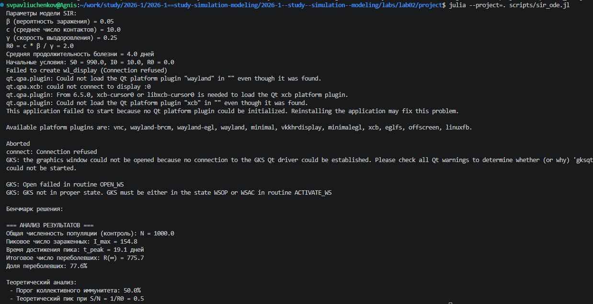
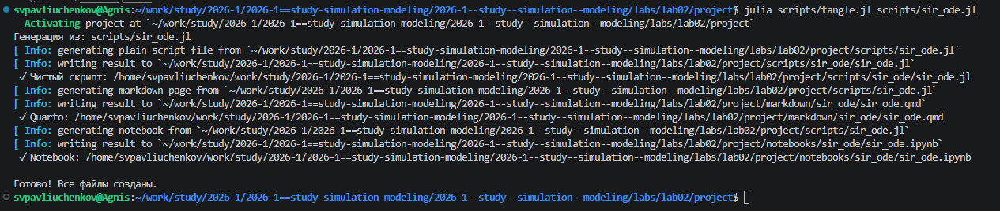
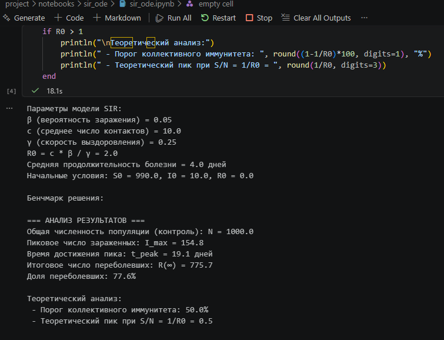
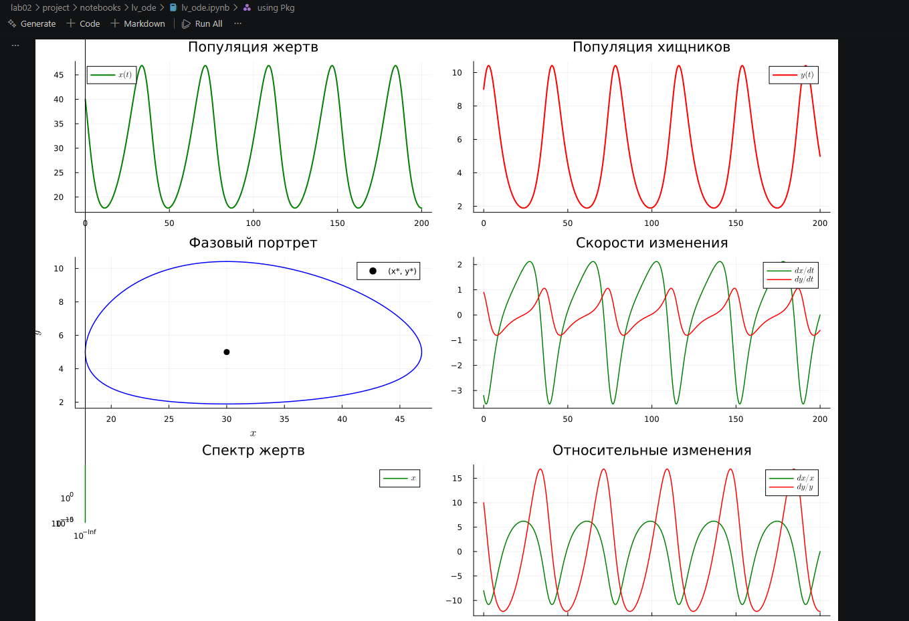

---
## Author
author:
  name: Сергей Витальевич Павлюченков
  email: 1132237372@rudn.ru
  affiliation:
    - name: Российский университет дружбы народов
      country: Российская Федерация
      postal-code: 117198
      city: Москва
      address: ул. Миклухо-Маклая, д. 6

## Title
title: "Отчёт по лабораторной работе № 2"
subtitle: "Основные модели"
license: "CC BY"
---

# Цель работы

Изучить основные модели SIR и Лотки–Вольтерры, а также аспекты их программной реализации.

# Задание

- Создать рабочий каталог для кода.
- Установить необходимые пакеты.
- Выполнить предложенный код.
- Преобразовать код в литературный стиль.
- Сгенерировать из литературного кода:
	- чистый код;
	- jupyter notebook;
	- документацию в формате Quarto.
- Выполнить код из jupyter notebook.
- Интегрировать документацию в формате Quarto в отчёт.
- Добавить в код в литературном стиле вычисление для набора параметров.
- Сгенерировать из литературного кода с параметрами:
	- чистый код;
	- jupyter notebook;
	- документацию в формате Quarto.
- Выполнить код из jupyter notebook с параметрами.
- Интегрировать документацию с параметрами в формате Quarto в отчёт.
# Выполнение лабораторной работы

 Создаем и запускаем sir_ode.jl.([рис. @fig-001]).

{#fig-001 width=70%}

 Создаём производные форматы([рис. @fig-002]).

{#fig-002 width=70%}

 Открываем и запускаем полученный jupyter-notebook([рис. @fig-003]).

{#fig-003 width=70%}

# Модель SIR



Аналогично создаем файл lv_ode.jl. Запускаем его, получаем производные форматы.

 Запускаем все ячейки в полученном notebook'е и получаем графики([рис. @fig-004]).

{#fig-004 width=70%}

# Модель Лотки–Вольтерры



# Выводы

В ходе лабораторной работы были изучены основные модели SIR и Лотки–Вольтерры и их программная реализация.