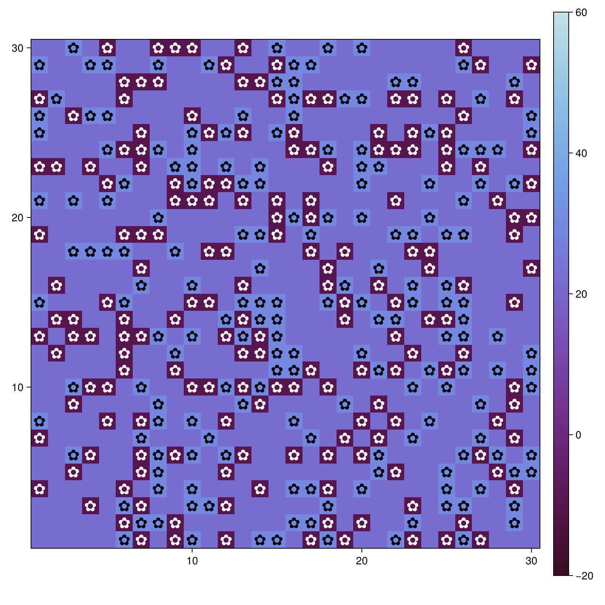
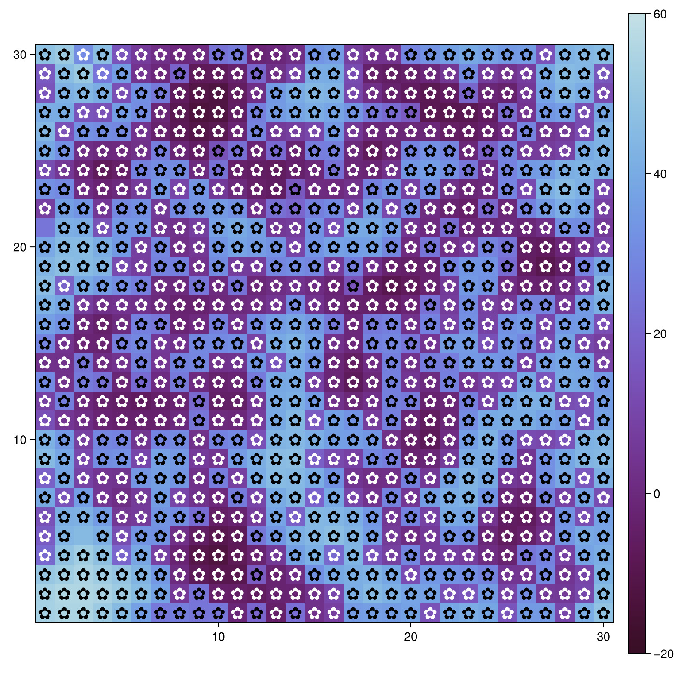
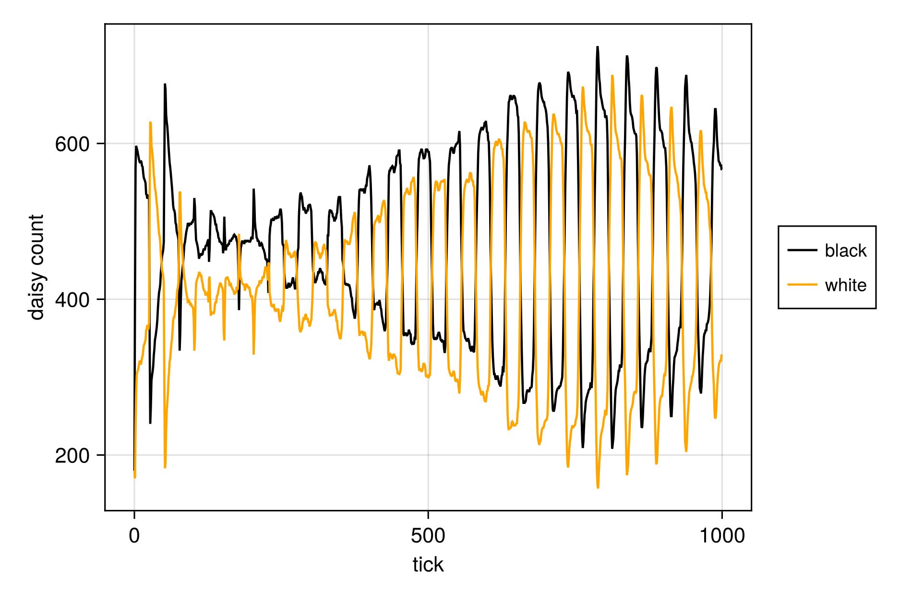
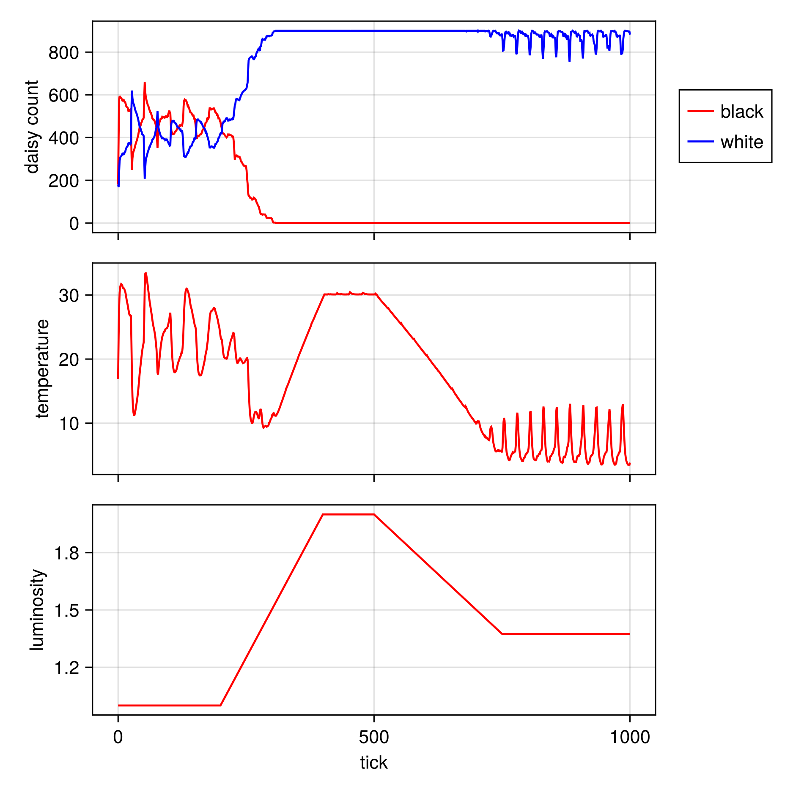

---
## Author
author:
  name: Сергей Витальевич Павлюченков
  email: 1132237372@rudn.ru
  affiliation:
    - name: Российский университет дружбы народов
      country: Российская Федерация
      postal-code: 117198
      city: Москва
      address: ул. Миклухо-Маклая, д. 6
## Title
title: Лабораторная работа №3
subtitle: Имитационное моделирование
license: CC BY
date: today
date-format: "YYYY-MM-DD" # Example: 2025-09-06
---

## Докладчик

:::::::::::::: {.columns align=center}
::: {.column width="70%"}

  * Павлюченков Сергей Витальевич
  * Студент группы НКНбд-01-23
  * Российский университет дружбы народов им. П. Лумумбы

:::
::: {.column width="30%"}

:::
::::::::::::::

# Вводная часть

## Актуальность

- Агентное моделирование показывает, как глобальное поведение возникает из локальных правил
- DaisyWorld иллюстрирует гипотезу Геи: саморегуляцию температуры планеты

## Цели и задачи

- Ознакомиться с моделью DaisyWorld
- Визуально реализовать модель с маргаритками в Agents.jl

## Материалы и методы

- Язык Julia и библиотека Agents.jl
- DrWatson для структуры проекта
- Скрипты конвертируются в чистый код, Jupyter notebook и Quarto-документ

## Базовая визуализация

Тепловая карта температуры с маргаритками, показанными черно-белыми по их виду, на шагах 1 и 40 ([рис. @fig-002], [рис. @fig-003]).

:::::::::::::: {.columns}
::: {.column width="50%"}

{#fig-002 width=100%}

:::
::: {.column width="50%"}

{#fig-003 width=100%}

:::
::::::::::::::

# Результаты

## Динамика числа маргариток

График показывает изменение числа чёрных и белых маргариток по модельному времени ([рис. @fig-005]).

{#fig-005 width=70%}

## Динамика модели

Температура и светимость солнца во времени, а также число маргариток. В скрипте задан сценарий изменения светимости (ramp) ([рис. @fig-006]).

{#fig-006 width=40%}

# выводы

- Изучена модель DaisyWorld
- Модель визуально реализована с помощью Agents.jl
- Построены графики: сетка, динамика числа маргариток и светимости, параметрические прогоны

