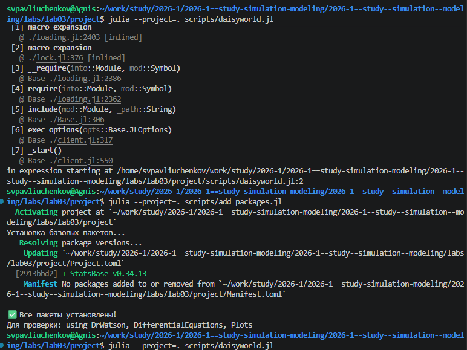
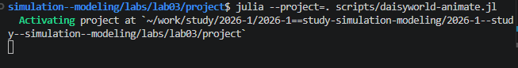
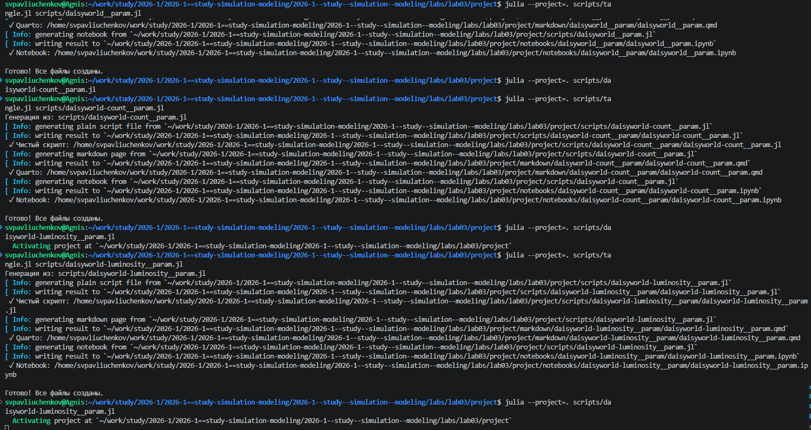

---
## Author
author:
  name: Сергей Витальевич Павлюченков
  email: 1132237372@rudn.ru
  affiliation:
    - name: Российский университет дружбы народов
      country: Российская Федерация
      postal-code: 117198
      city: Москва
      address: ул. Миклухо-Маклая, д. 6

## Title
title: "Отчёт по лабораторной работе №3 "
subtitle: "Агентное моделирование"
license: "CC BY"
---

# Цель работы

Ознакомиться с моделью Daisyworld и выполнить её визуальную реализацию с помощью Agents.jl.

# Задание

- Создать рабочий каталог для кода.
- Установить необходимые пакеты.
- Выполнить предложенный код.
- Преобразовать код в литературный стиль.
- Сгенерировать из литературного кода:
	- чистый код;
	- jupyter notebook;
	- документацию в формате Quarto.
- Выполнить код из jupyter notebook.
- Интегрировать документацию в формате Quarto в отчёт.
- Добавить в код в литературном стиле вычисление для набора параметров.
- Сгенерировать из литературного кода с параметрами:
	- чистый код;
	- jupyter notebook;
	- документацию в формате Quarto.
- Выполнить код из jupyter notebook с параметрами.
- Интегрировать документацию с параметрами в формате Quarto в отчёт.
- Результирующие файлы не удалять, выложить на git.

# Выполнение лабораторной работы

Добавляем пакеты для работы и Создаем файл scripts/daisyworld.jl, src/daisyworld.jl и запускаем скрипт([рис. @fig-001]).

{#fig-001 width=70%}

Аналогично создаем и запускаем daisworld-count.jl, daisyworld-animate.jl, daisyworld-luminosity.jl ([рис. @fig-002]).

{#fig-002 width=70%}

После чего создаем производные файлы ([рис. @fig-003]).

{#fig-003 width=70%}











# Выводы

В ходе лабораторной работы была изучена модель Daisyworld и выполнена её визуальная реализация с помощью Agents.jl.