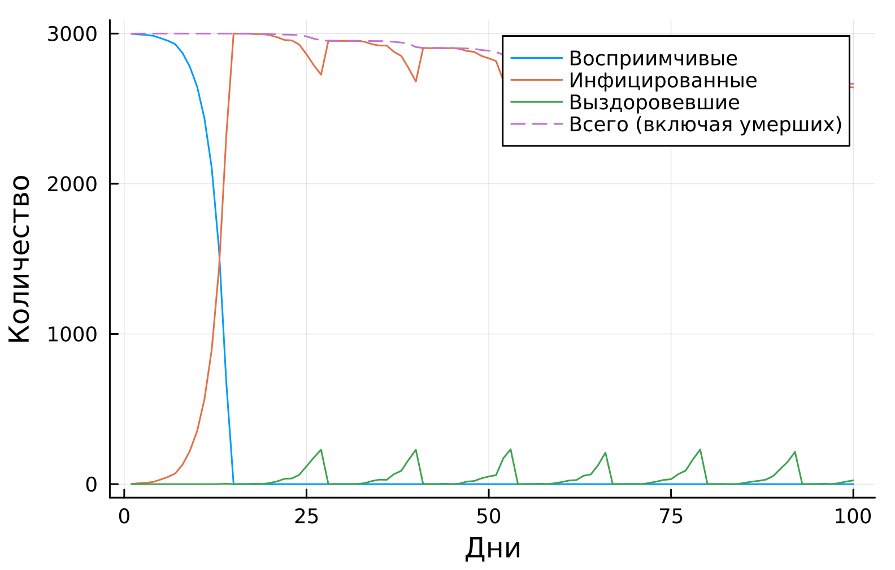
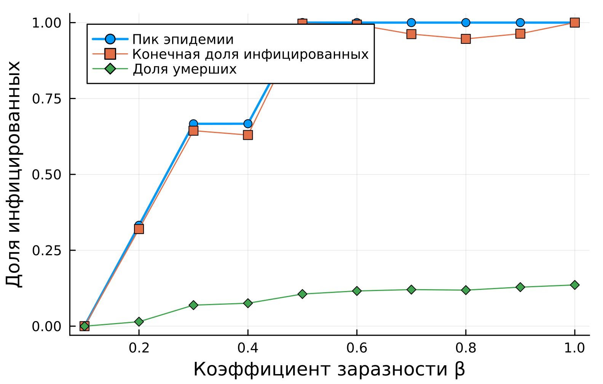
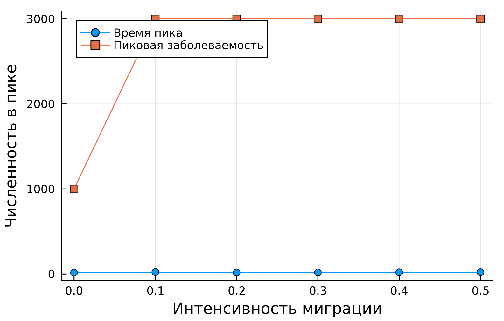
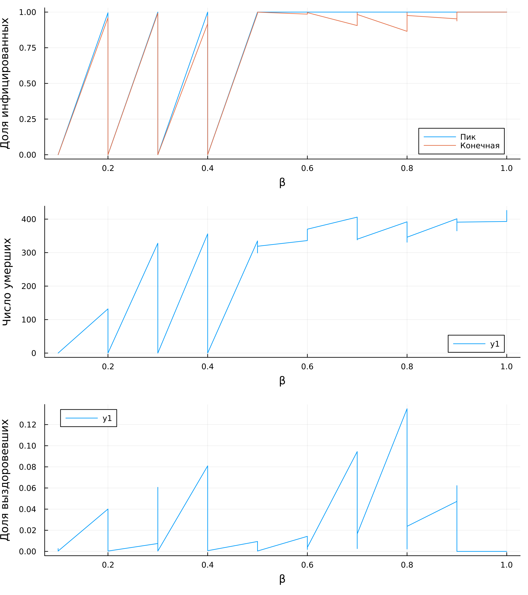

---
## Author
author:
  name: Сергей Витальевич Павлюченков
  email: 1132237372@rudn.ru
  affiliation:
    - name: Российский университет дружбы народов
      country: Российская Федерация
      postal-code: 117198
      city: Москва
      address: ул. Миклухо-Маклая, д. 6
## Title
title: Лабораторная работа №4
subtitle: Имитационное моделирование
license: CC BY
date: today
date-format: "YYYY-MM-DD" # Example: 2025-09-06
---

## Докладчик

:::::::::::::: {.columns align=center}
::: {.column width="70%"}

  * Павлюченков Сергей Витальевич
  * Студент группы НКНбд-01-23
  * Российский университет дружбы народов им. П. Лумумбы

:::
::: {.column width="30%"}

:::
::::::::::::::

# Вводная часть

## Актуальность

- Эпидемию можно описать детерминированно (ОДУ) или агентно
- Агентный подход учитывает индивидуальные характеристики, стохастичность и пространственную структуру

## Цели и задачи

- Сравнить детерминированный (SIR на ОДУ) и стохастический (агентный) подходы к моделированию эпидемий
- Оценить преимущества агентного моделирования в учёте пространственной структуры и индивидуальных характеристик агентов

# Реализация

## Базовый эксперимент

- Города: $N_s = [1000, 1000, 1000]$, инфекция только в третьем городе ($I_s = [0, 0, 1]$)
- $\beta_{und} = 0.5$, $\beta_{det} = 0.05$, длительность болезни 14 дней, выявление через 7 дней
- Смертность 0.02, повторное заражение 0.1, 100 шагов

{#fig-002 width=70%}

# Сканирование коэффициента заразности

- $\beta$ от 0.1 до 1.0 с шагом 0.1, $\beta_{det} = \beta / 10$
- Три прогона с seed 42, 43, 44 для каждого значения $\beta$
- Метрики: пик заболеваемости, итоговая доля переболевших, число умерших

{#fig-003 width=70%}

## Эффект миграции

- Интенсивность миграции от 0 до 0.5 с шагом 0.1
- Вероятность остаться в городе $1 - intensity$, переехать в другой город $intensity / (C-1)$
- Инфекция только в первом городе, 150 шагов, seed 42, 43, 44
- Метрики: время достижения пика и величина пика

{#fig-004 width=70%}

## Сводная визуализация

- Три панели: пик и конечная доля инфицированных, число умерших, доля выздоровевших (от $\beta$)

{#fig-005 width=20%}

## Результаты

- Агентная модель воспроизводит стохастичность эпидемии, которой нет в детерминированной модели
- Агентный подход позволяет задавать миграцию и индивидуальные параметры агентов
- Количественные результаты: [дополнить по графикам и таблицам]

## Выводы

- Изучены детерминированный (SIR на ОДУ) и стохастический агентный подходы к моделированию эпидемий
- Агентное моделирование учитывает пространственную структуру и индивидуальные характеристики агентов