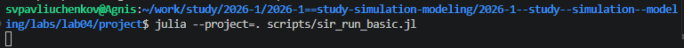
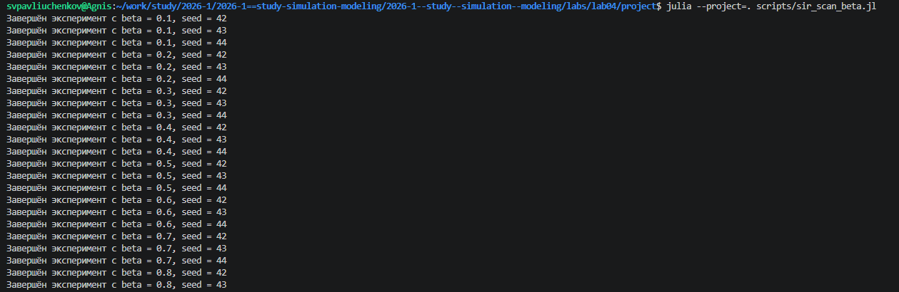
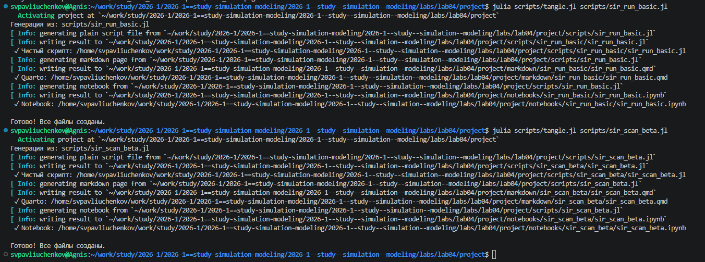
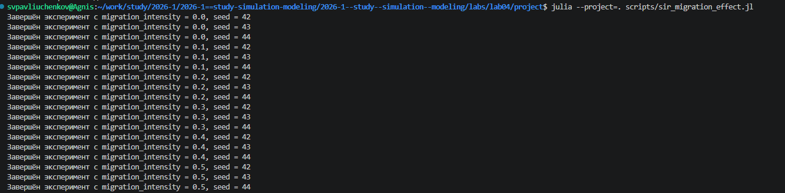
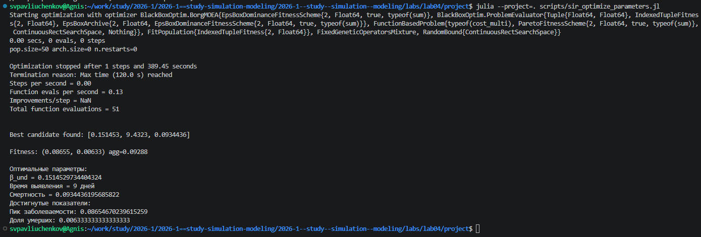
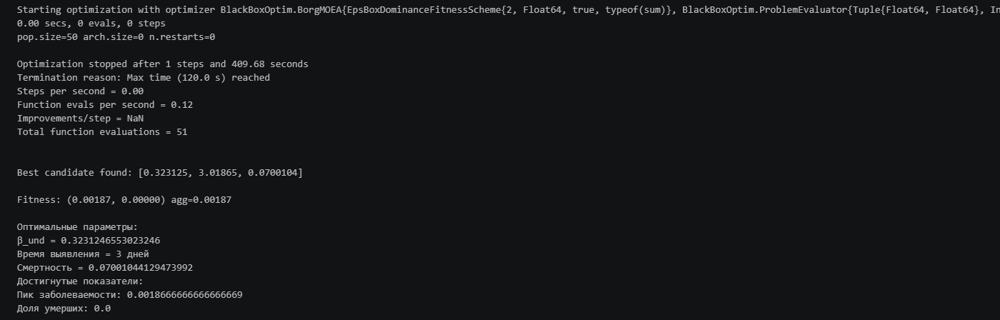

---
## Author
author:
  name: Сергей Витальевич Павлюченков
  email: 1132237372@rudn.ru
  affiliation:
    - name: Российский университет дружбы народов
      country: Российская Федерация
      postal-code: 117198
      city: Москва
      address: ул. Миклухо-Маклая, д. 6

## Title
title: "Отчёт по лабораторной работе № 4"
subtitle: "Реализация основных моделей в агентном подходе"
license: "CC BY"
---

# Цель работы

Cоздадим агентную модель распространения инфекционного заболевания на
основе классической компартментальной модели SIR (Susceptible-Infectious-
Recovered). Модель будет реализована с использованием пакета Agents.jl. В от-
личие от классической модели на дифференциальных уравнениях, агентный
подход позволит учесть индивидуальные характеристики, пространственную
структуру и стохастичность процессов.

# Задание

- Создать рабочий каталог для кода.
- Установить необходимые пакеты.
- Выполнить предложенный код.
- Преобразовать код в литературный стиль.
- Сгенерировать из литературного кода:
	- чистый код;
	- jupyter notebook;
	- документацию в формате Quarto.
- Выполнить код из jupyter notebook.
- Интегрировать документацию в формате Quarto в отчёт.
- Добавить в код в литературном стиле вычисление для набора параметров.
- Сгенерировать из литературного кода с параметрами:
	- чистый код;
	- jupyter notebook;
	- документацию в формате Quarto.
- Выполнить код из jupyter notebook с параметрами.
- Интегрировать документацию с параметрами в формате Quarto в отчёт.

# Выполнение лабораторной работы

После подготовки окружения и создания файла sir__run_basic.jl мы его запускаем.  ([рис. @fig-001]).

{#fig-001 width=70%}

мы запускаем sir_scan_beta.jl ([рис. @fig-002]).

{#fig-002 width=70%}

Когда удостоверимся, что всё работает корректно, создаем производный файл. ([рис. @fig-003]).

{#fig-003 width=70%}





Всё то мы запускаем sir_migration_effect.jl. ([рис. @fig-004]).

{#fig-004 width=70%}



После чего запускаем sir_optimize_parameters.jl и находим оптимальные параметры.  ([рис. @fig-005]).

{#fig-005 width=70%}

После чего опять создаем производные файлы



Посмотрим в ноутбуке, проверяем достоверность оптимальных параметров. Давай там ещё раз расчет. ([рис. @fig-006]).

{#fig-006 width=70%}

После чего получаем все графики и проводим полный анализ. Работа была продолжена в следующем кеймда-файле. 



# Выводы

В ходе лабораторной работы были изучены детерминированный (модель SIR на ОДУ) и стохастический подходы к моделированию эпидемий, оценены преимущества агентного моделирования в учёте пространственной структуры и индивидуальных характеристик агентов.