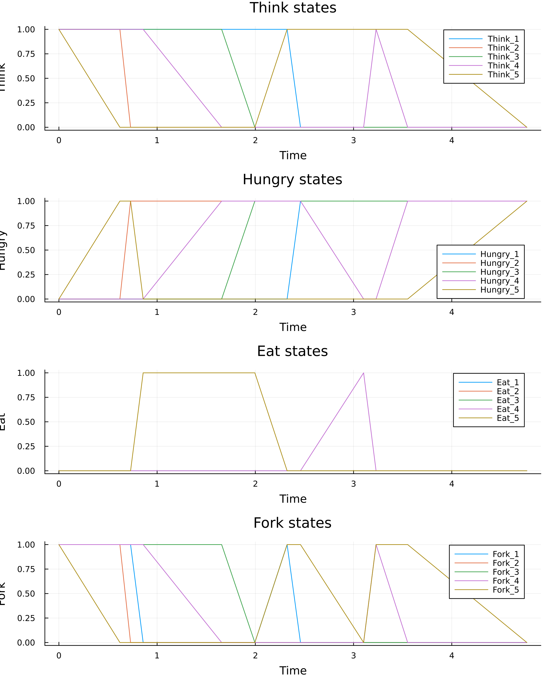
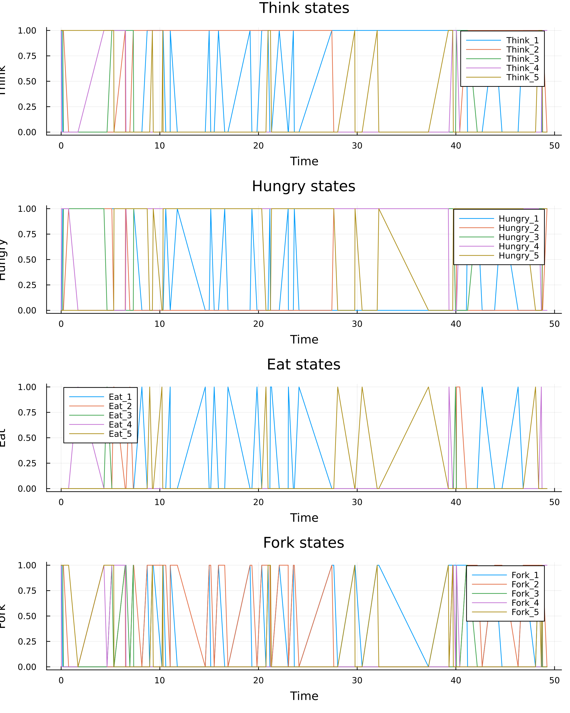
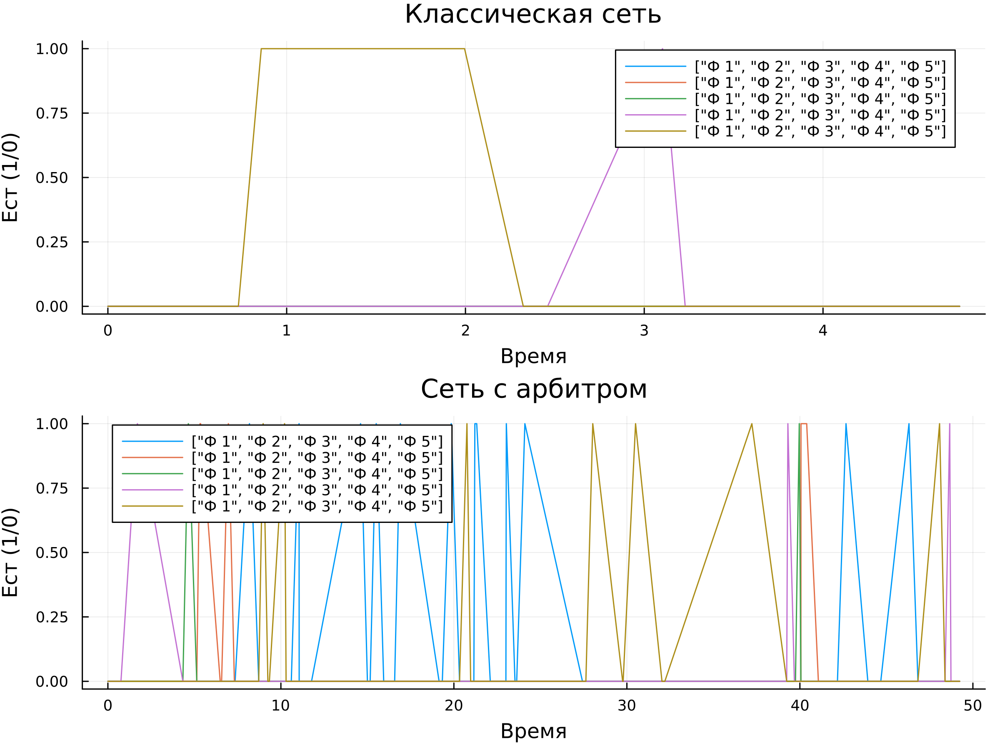

---
## Author
author:
  name: Сергей Витальевич Павлюченков
  email: 1132237372@rudn.ru
  affiliation:
    - name: Российский университет дружбы народов
      country: Российская Федерация
      postal-code: 117198
      city: Москва
      address: ул. Миклухо-Маклая, д. 6
## Title
title: Лабораторная работа №5
subtitle: Имитационное моделирование
license: CC BY
date: today
date-format: "YYYY-MM-DD" # Example: 2025-09-06
---

## Докладчик

:::::::::::::: {.columns align=center}
::: {.column width="70%"}

  * Павлюченков Сергей Витальевич
  * Студент группы НКНбд-01-23
  * Российский университет дружбы народов им. П. Лумумбы

:::
::: {.column width="30%"}

:::
::::::::::::::

# Вводная часть

## Актуальность
 
- Задача «Обедающие философы» (Дейкстра, 1965) моделирует проблемы синхронизации в параллельных системах
- Взаимная блокировка (deadlock) возникает при конкурентном доступе к разделяемым ресурсам: база данных, принтер, планирование задач ОС

## Цели и задачи

- Построить сеть Петри для пяти философов и выявить состояние взаимной блокировки
- Модифицировать сеть (добавить арбитра) так, чтобы deadlock не возникал

## Материалы и методы

- Сети Петри: позиции, переходы, фишки, дуги
- Язык Julia: решение ОДУ (детерминированная модель) и алгоритм Гиллеспи (стохастическая модель)
- Структура проекта DrWatson, скрипты преобразуются через Literate.jl

## Результаты: классическая сеть

{#fig-002 width=35%}

- По результатам моделирования все состояния Eat постепенно становятся нулевыми, а философы остаются в состоянии Hungry

## Результаты: сеть с арбитром

{#fig-003 width=35%}

## Итоговое сравнение

{#fig-005 width=70%}

- Классическая сеть: линии Eat падают до нуля и остаются на нуле
- Сеть с арбитром: всегда есть философ, который ест

## Вывод

- Построены классическая и модифицированная сети Петри для задачи «Обедающие философы»
- Классическая сеть приводит к взаимной блокировке, арбитр в проведённом эксперименте её предотвращает
- Результаты подтверждены графиками, анимацией и сводным сравнением