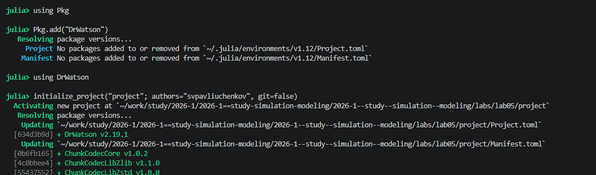
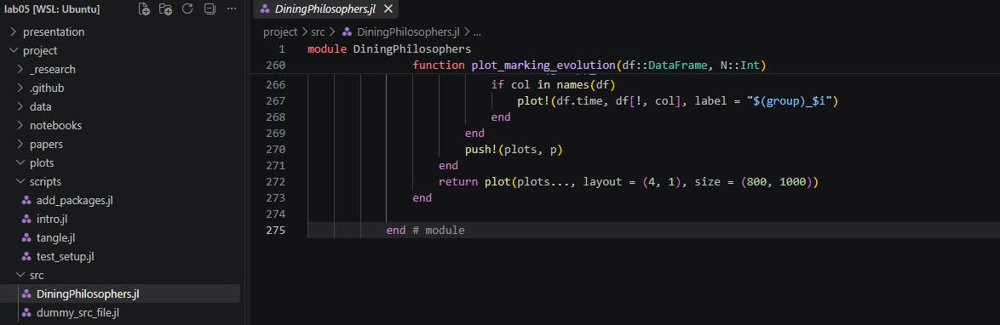
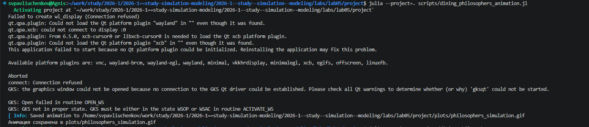
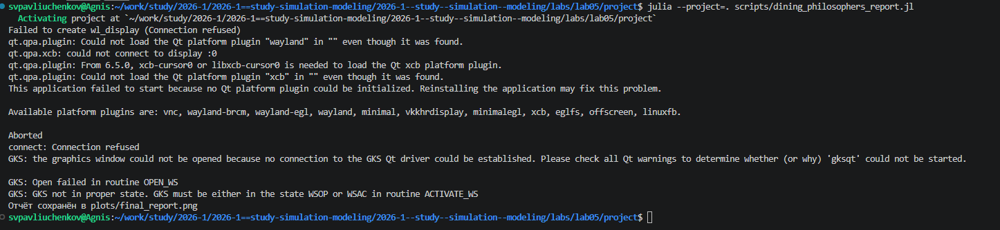

---
## Author
author:
  name: Сергей Витальевич Павлюченков
  email: 1132237372@rudn.ru
  affiliation:
    - name: Российский университет дружбы народов
      country: Российская Федерация
      postal-code: 117198
      city: Москва
      address: ул. Миклухо-Маклая, д. 6

## Title
title: "Отчёт по лабораторной работе № 5"
subtitle: "Аппарат сетей Петри"
license: "CC BY"
---

# Цель работы

Здесь приводится формулировка цели лабораторной работы.

# Задание

- Создать рабочий каталог для кода.
- Установить необходимые пакеты.
- Выполнить предложенный код.
- Преобразовать код в литературный стиль.
- Сгенерировать из литературного кода:
	- чистый код;
	- jupyter notebook;
	- документацию в формате Quarto.
- Выполнить код из jupyter notebook.
- Интегрировать документацию в формате Quarto в отчёт.
- Добавить в код в литературном стиле вычисление для набора параметров.
- Сгенерировать из литературного кода с параметрами:
	- чистый код;
	- jupyter notebook;
	- документацию в формате Quarto.
- Выполнить код из jupyter notebook с параметрами.
- Интегрировать документацию с параметрами в формате Quarto в отчёт.
# Выполнение лабораторной работы

я использую add_packages.jl, чтобы добавить недостающие пакеты для работы. ([рис. @fig-001]).

{#fig-001 width=70%}

Создаю все необходимые файлы для работы, в том числе diningphilosopher.jl.  ([рис. @fig-002]).



{#fig-002 width=70%}

 Мы успешно создаем и запускаем только что созданный файл. ([рис. @fig-003]).

{#fig-003 width=70%}

 Теперь мы создаем и запускаем Dining_Philosophers_Animation.jl и получаем анимированный график. ([рис. @fig-005]).

{#fig-005 width=70%}



Вот что мы создаем и запускаем: dining_philosophers_report.jl. ([рис. @fig-004]).

{#fig-004 width=70%}



# Выводы

В ходе работы были построены классические и модифицированные сети Петри для задачи «dining philosophers». Проведено статистическое и детерминированное моделирование. 
