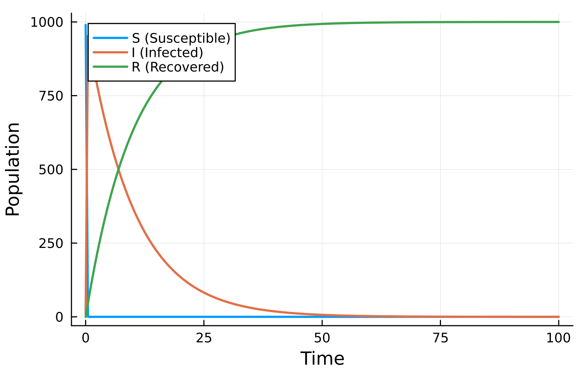
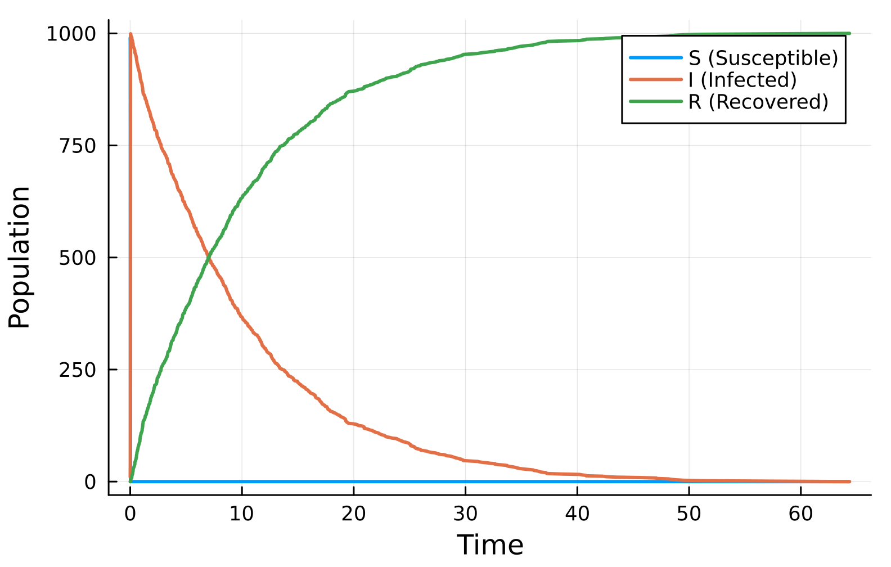
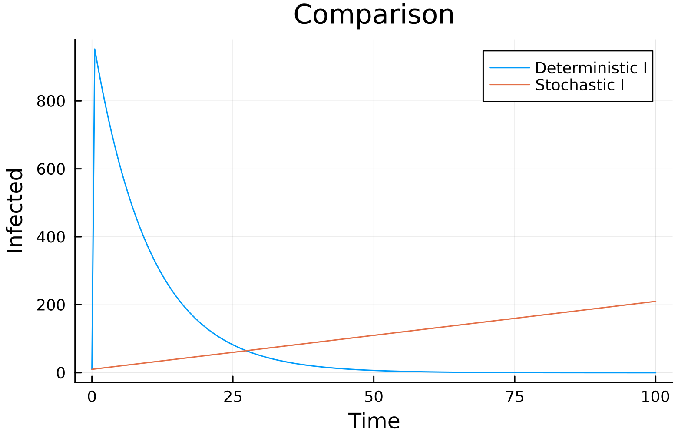
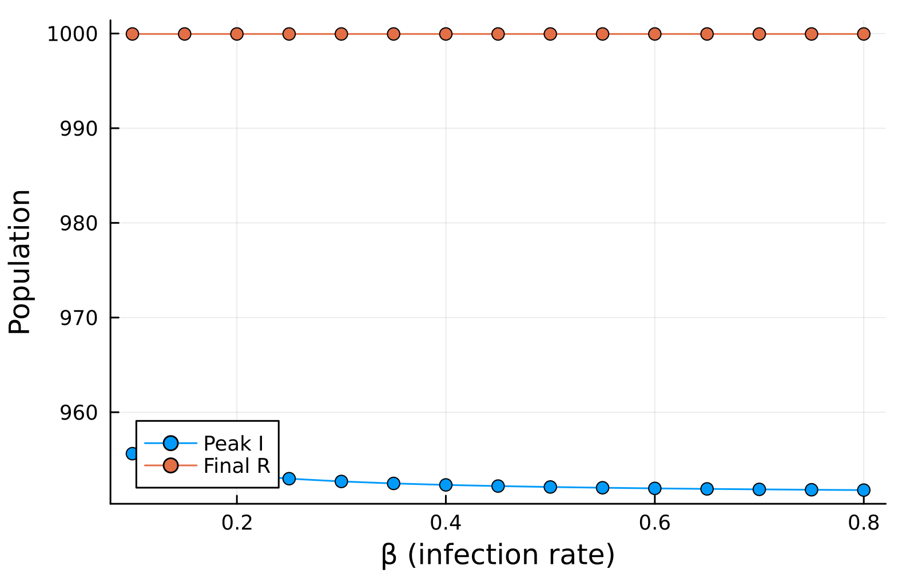

---
## Author
author:
  name: Сергей Витальевич Павлюченков
  email: 1132237372@rudn.ru
  affiliation:
    - name: Российский университет дружбы народов
      country: Российская Федерация
      postal-code: 117198
      city: Москва
      address: ул. Миклухо-Маклая, д. 6
## Title
title: Лабораторная работа №6
subtitle: Имитационное моделирование
license: CC BY
date: today
date-format: "YYYY-MM-DD" # Example: 2025-09-06
---

## Докладчик

:::::::::::::: {.columns align=center}
::: {.column width="70%"}

  * Павлюченков Сергей Витальевич
  * Студент группы НКНбд-01-23
  * Российский университет дружбы народов им. П. Лумумбы

:::
::: {.column width="30%"}

:::
::::::::::::::

# Вводная часть

## Актуальность

- Эпидемии удобно исследовать с помощью имитационных моделей, например модели SIR
- Сети Петри позволяют наглядно описывать дискретные события и переходы состояний

## Объект и предмет исследования

- Объект: эпидемиологическая модель SIR (восприимчивые, инфицированные, выздоровевшие)
- Предмет: реализация модели SIR в виде сети Петри и анализ её динамики

## Цели и задачи

- Реализовать модель распространения эпидемии SIR с помощью сетей Петри
- Проанализировать детерминированную и стохастическую динамику и влияние коэффициента β

# Результаты

## Детерминированная динамика

Решение системы ОДУ даёт сглаженную картину: число инфицированных сначала растёт, достигает максимума и затем снижается. Число выздоровевших растёт и выходит на плато, число восприимчивых уменьшается.

{#fig-003 width=60%}

## Стохастическая динамика

Алгоритм Гиллеспи добавляет случайные колебания. Время и величина пика могут немного отличаться от детерминированного решения, однако при большом числе восприимчивых (990) траектории близки.

{#fig-004 width=60%}

## Сравнение моделей

Различия между детерминированной и стохастической моделями малы при большой начальной численности восприимчивых и становятся заметнее при меньших значениях.

{#fig-005 width=60%}

## Коэффициент заражения β

Для β от 0.1 до 0.8 (шаг 0.05, γ = 0.1) наблюдается пороговое поведение: при малых β эпидемия не возникает, с ростом β пик заболеваемости резко растёт и затем выходит на насыщение, а доля переболевших увеличивается.

{#fig-006 width=50%}

## Выводы

- Модель SIR реализована в виде сети Петри, выполнены детерминированный и стохастический прогоны
- Коэффициент β определяет наличие и масштаб вспышки: при его увеличении растёт пик числа инфицированных
- Модель в целом корректно отражает основные закономерности распространения эпидемии
