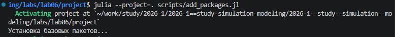
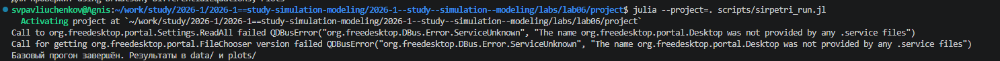
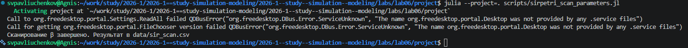
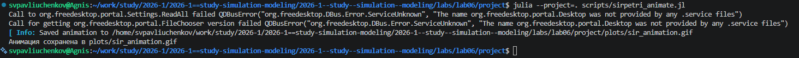
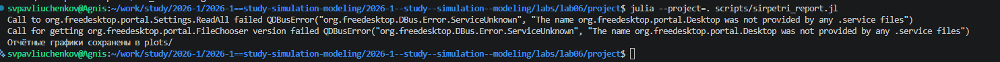
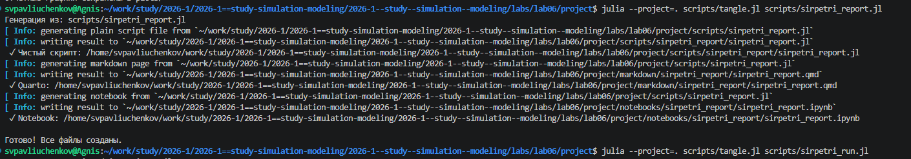
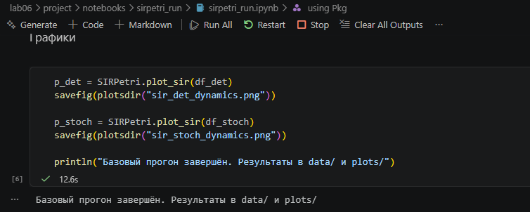
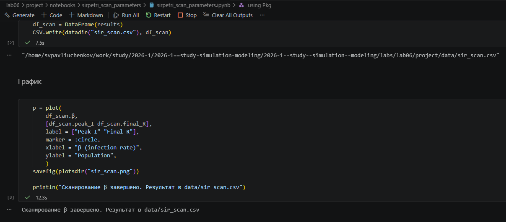
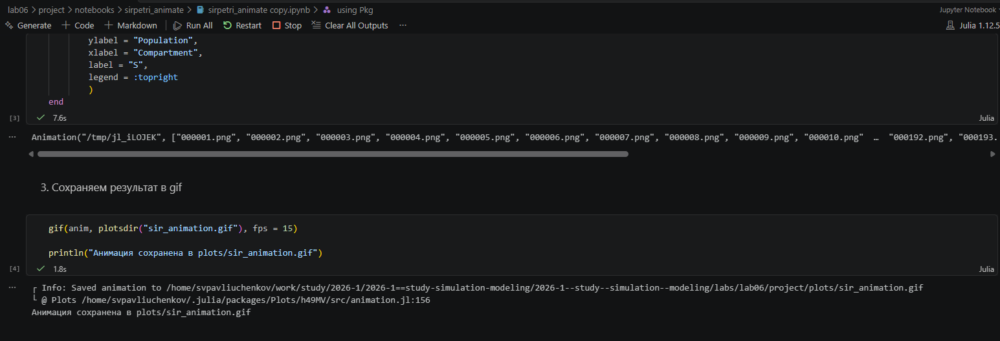
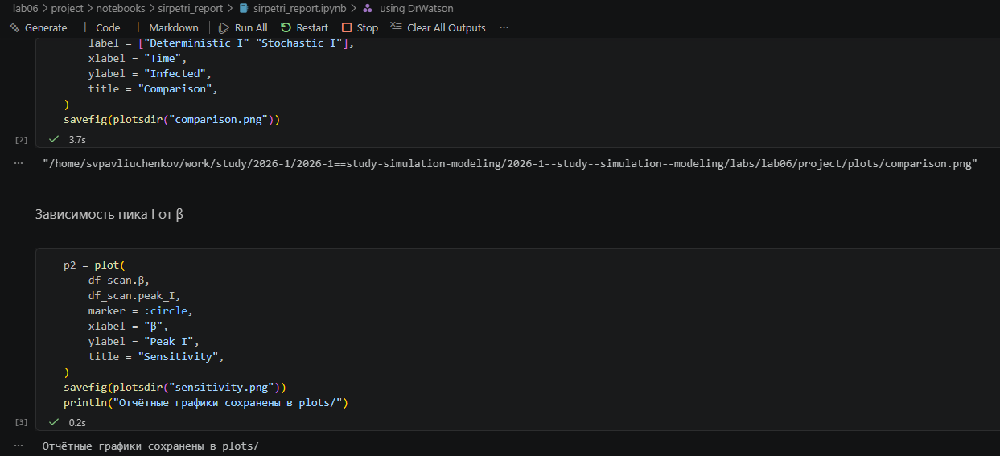

---
## Author
author:
  name: Сергей Витальевич Павлюченков
  email: 1132237372@rudn.ru
  affiliation:
    - name: Российский университет дружбы народов
      country: Российская Федерация
      postal-code: 117198
      city: Москва
      address: ул. Миклухо-Маклая, д. 6

## Title
title: "Отчёт по лабораторной работе № 6"
subtitle: "Реализация основных моделей в подходе сетей Петри"
license: "CC BY"
---

# Цель работы

Разработать и реализовать модель распространения эпидемии SIR с применением сетей Петри, а также проанализировать полученные результаты моделирования.

# Задание

- Создать рабочий каталог для кода.
- Установить необходимые пакеты.
- Выполнить предложенный код.
- Преобразовать код в литературный стиль.
- Сгенерировать из литературного кода:
	- чистый код;
	- jupyter notebook;
	- документацию в формате Quarto.
- Выполнить код из jupyter notebook.
- Интегрировать документацию в формате Quarto в отчёт.
- Добавить в код в литературном стиле вычисление для набора параметров.
- Сгенерировать из литературного кода с параметрами:
	- чистый код;
	- jupyter notebook;
	- документацию в формате Quarto.
- Выполнить код из jupyter notebook с параметрами.
- Интегрировать документацию с параметрами в формате Quarto в отчёт.

# Выполнение лабораторной работы

я использую add_packages.jl, чтобы добавить недостающие пакеты для работы. ([рис. @fig-001]).

{#fig-001 width=70%}

Создаю и запускаю sir_petri_run.jl. ([рис. @fig-002]).

{#fig-002 width=70%}



Воссоздаю. sirpetri_scan_parameters.jl запускает сканирование, и результат записывается в data_sir_scan.csv. ([рис. @fig-003]).

{#fig-003 width=70%}

В the sirpetri_animate.jl и получаю gif-файл. ([рис. @fig-004]).

{#fig-004 width=70%}

Аналогично создаю sirpetri_report.jl, запускаю и получаю отчетные графики ([рис. @fig-005]).

{#fig-005 width=70%}

Создаю Производные файлы ([рис. @fig-006]).

{#fig-006 width=70%}

Делаю базовый прогон ноутбука sir_petry_run.ipynb. ([рис. @fig-007]).

{#fig-007 width=70%}

Аналогично, делаю сканирование с sirpetri_scan_parameters.ipynb ([рис. @fig-008]).

{#fig-008 width=70%}



Прогоняю sirpetri_animate.ipynb и получаю финальный аниматор. ([рис. @fig-009]).

{#fig-009 width=70%}



Запускаю sirpetri_report.ipynb и получаю  финальный отчет.  ([рис. @fig-010]).

{#fig-010 width=70%}



# Выводы

Во время лабораторной работы была реализована SIR-модель на основе сети Петра и проведено её исследование в детерминированном и стохастическом варианте, проанализировано влияние параметров на динимику эпидемии.