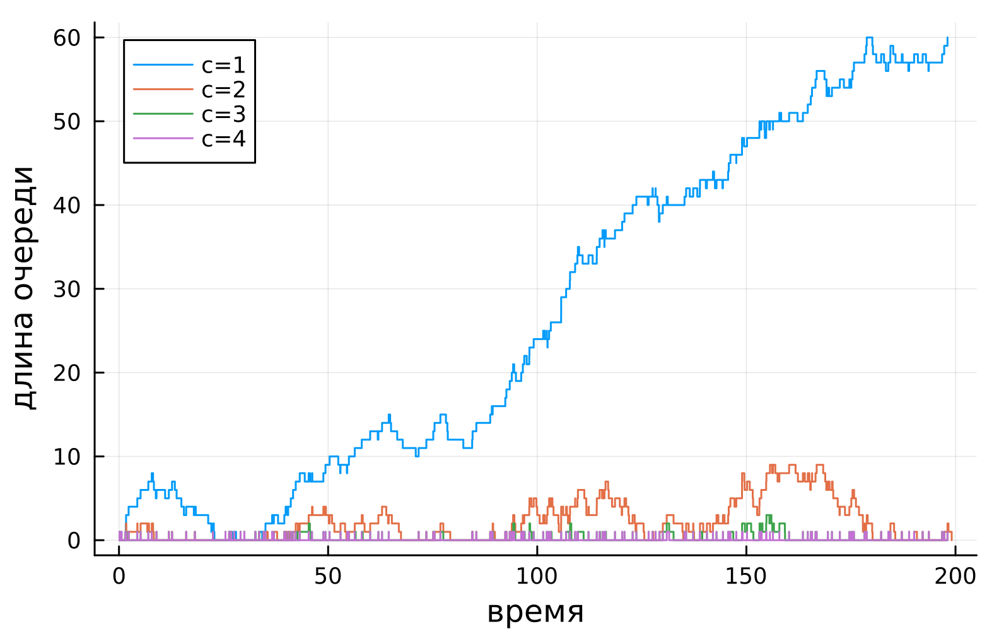
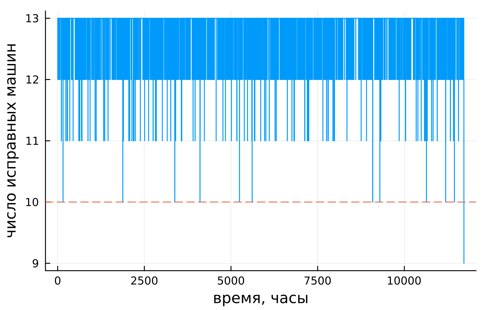
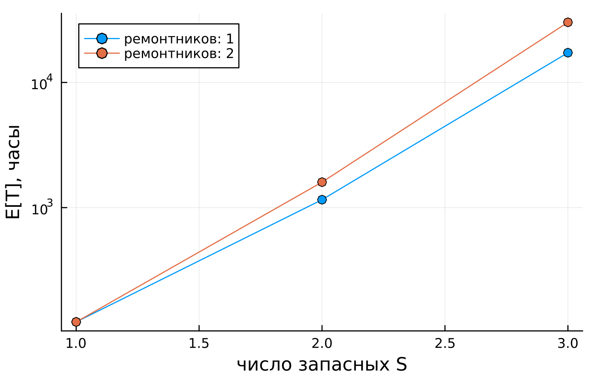
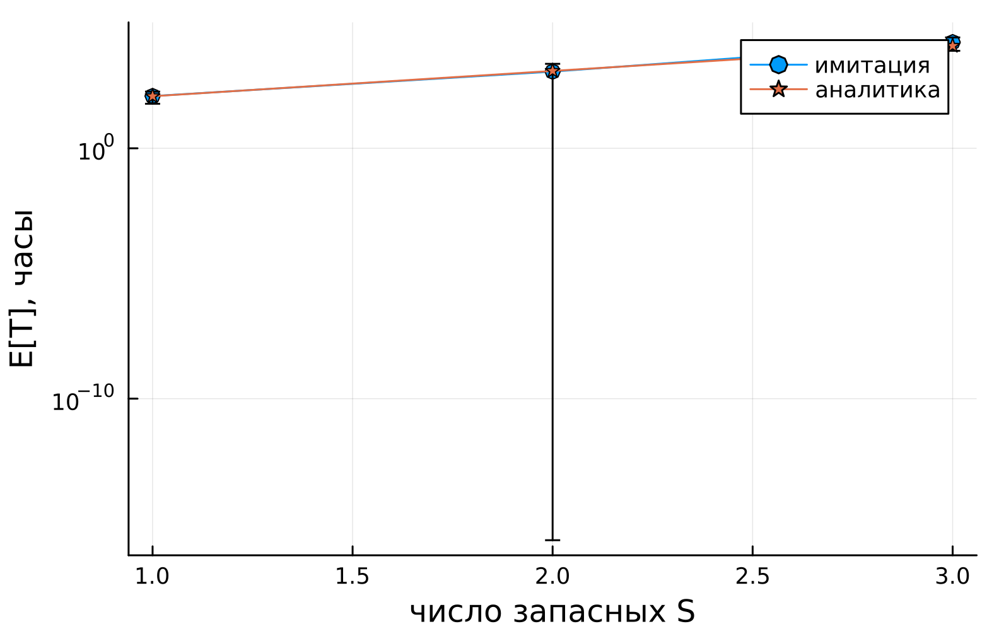

---
## Author
author:
  name: Сергей Витальевич Павлюченков
  email: 1132237372@rudn.ru
  affiliation:
    - name: Российский университет дружбы народов
      country: Российская Федерация
      postal-code: 117198
      city: Москва
      address: ул. Миклухо-Маклая, д. 6
## Title
title: Лабораторная работа №7
subtitle: Имитационное моделирование
license: CC BY
date: today
date-format: "YYYY-MM-DD" # Example: 2025-09-06
---

## Докладчик

:::::::::::::: {.columns align=center}
::: {.column width="70%"}

  * Павлюченков Сергей Витальевич
  * Студент группы НКНбд-01-23
  * Российский университет дружбы народов им. П. Лумумбы

:::
::: {.column width="30%"}

:::
::::::::::::::

# Вводная часть

## Актуальность

- Надёжность системы зависит от резерва запасных машин и скорости ремонта
- Имитация фиксирует случайные флуктуации запаса, которые усреднённые расчёты не учитывают

## Цели и задачи

- Реализовать имитационную модель Росса (задача о ремонте оборудования) дискретно-событийным методом
- Проанализировать показатели надёжности системы при различных нагрузках

# Результаты

## Время ожидания в очереди (M/M/c)

{#fig-001 width=70%}

## Исправные машины во времени

{#fig-002 width=70%}

## Загрузка ремонтной базы

{#fig-003 width=70%}

## Зависимость времени до краха

{#fig-004 width=70%}

## Выводы

- Реализована имитационная модель Росса с использованием дискретно-событийного моделирования
- Выполнен анализ показателей надёжности системы при различных нагрузках

