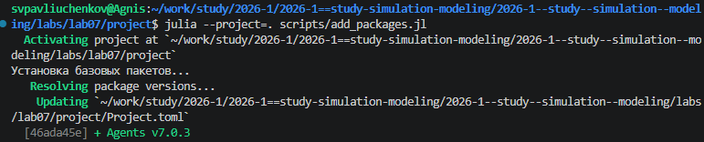
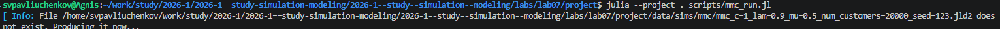
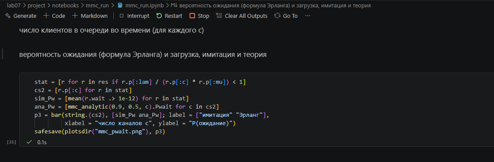
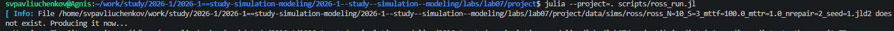
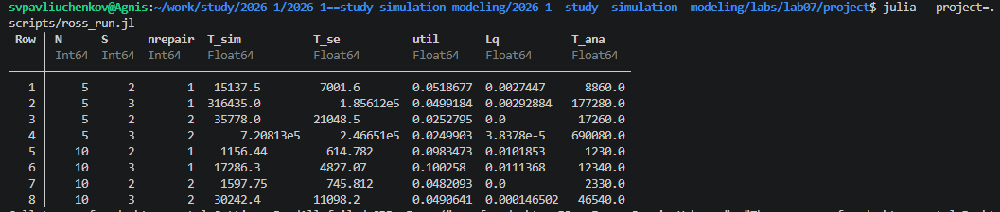
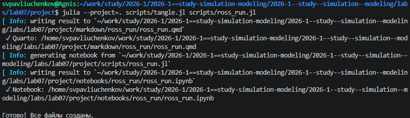
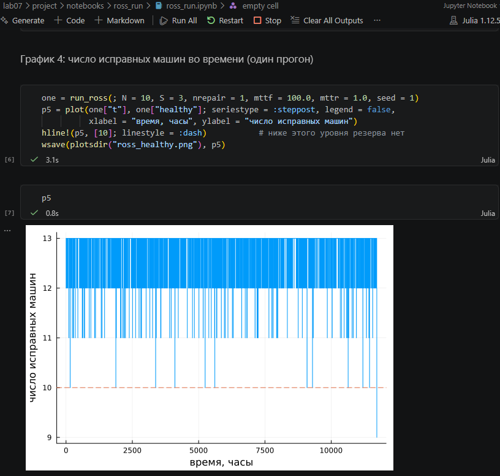
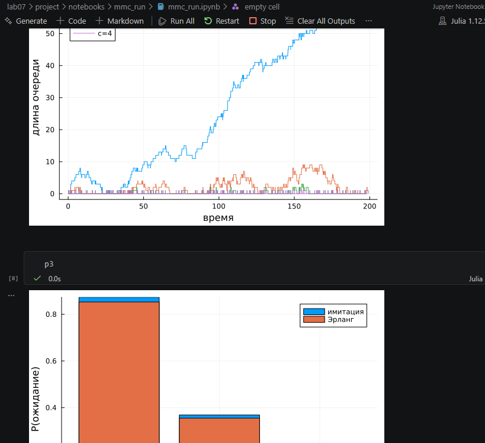

---
## Author
author:
  name: Сергей Витальевич Павлюченков
  email: 1132237372@rudn.ru
  affiliation:
    - name: Российский университет дружбы народов
      country: Российская Федерация
      postal-code: 117198
      city: Москва
      address: ул. Миклухо-Маклая, д. 6

## Title
title: "Отчёт по лабораторной работе № 7"
subtitle: "Дискретно-событийное моделирование"
license: "CC BY"
---

# Цель работы

Реализовать имитационную модель Росса, используя дискретное симуляционное моделирование, и проанализировать показатель надежности системы при различных нагрузках. 

# Задание

- Создать рабочий каталог для кода.
- Установить необходимые пакеты.
- Выполнить предложенный код.
- Преобразовать код в литературный стиль.
- Сгенерировать из литературного кода:
	- чистый код;
	- jupyter notebook;
	- документацию в формате Quarto.
- Выполнить код из jupyter notebook.
- Интегрировать документацию в формате Quarto в отчёт.
- Добавить в код в литературном стиле вычисление для набора параметров.
- Сгенерировать из литературного кода с параметрами:
	- чистый код;
	- jupyter notebook;
	- документацию в формате Quarto.
- Выполнить код из jupyter notebook с параметрами.
- Интегрировать документацию с параметрами в формате Quarto в отчёт.
# Выполнение лабораторной работы

Первым делом я добавил пакет с помощью кода add_packages.jl.  ([рис. @fig-001]).

{#fig-001 width=70%}

 Я создаю и запускаю скрипт MMC_run.jl([рис. @fig-002]).

{#fig-002 width=70%}

 После я создаю производные файлы с помощью tangle.jl и открываю полученный ноутбук. ([рис. @fig-003]).

{#fig-003 width=70%}

 После чего я создаю скрипт ross_run.jl, и запускаю его. ([рис. @fig-004]).

{#fig-004 width=70%}

 После ожидания мы  получаем таблицу со всеми результатами. ([рис. @fig-005]).

{#fig-005 width=70%}

 Создаю производные файлы для ross_run.jl c помощью tangle.jl ([рис. @fig-006]).

{#fig-006 width=70%}

 Открываем Notebook, выполняем вычисления и получаем график. ([рис. @fig-007]). Нам видно, что только спустя более чем 10000 часов при конфигурации N=10, S=3, nrepair=1, машина упала ниже линии невозврата. 

{#fig-007 width=70%}



Ну и мы получаем оставшиеся графики, которые нам нужны были, например, дельта уравнения зависимости от количества современных, зависимости от с в m/m/c. И также сравнение имитации с аналитическими результатами, которые оказались довольно точными   ([рис. @fig-008]).

{#fig-008 width=70%}



# Выводы

Модель протона работы реализована по модели Росса. Используем дискретно-симуляционное моделирование и проанализирован показатель надежности системы при различных нагрузках. 