---
## Author
author:
  name: Сергей Витальевич Павлюченков
  email: 1132237372@rudn.ru
  affiliation:
    - name: Российский университет дружбы народов
      country: Российская Федерация
      postal-code: 117198
      city: Москва
      address: ул. Миклухо-Маклая, д. 6

## Title
title: "Отчёт по лабораторной работе №8 "
subtitle: "Реализация основных моделей в дискретно-событийном подходе"
license: "CC BY"
---

# Цель работы

Изучить дискретно-событийный подход к имитационному моделированию на
примере классической модели распространения инфекции SIR. Реализовать сто-
хастическую дискретно-событийную модель в виде программного комплекса на
языке Julia. Провести анализ влияния параметров, сравнить со стохастической и
детерминированной версиями, оценить производительность и модифицировать
модель.

# Задание

- Создать рабочий каталог для кода.
- Установить необходимые пакеты.
- Выполнить предложенный код.
- Преобразовать код в литературный стиль.
- Сгенерировать из литературного кода:
	- чистый код;
	- jupyter notebook;
	- документацию в формате Quarto.
- Выполнить код из jupyter notebook.
- Интегрировать документацию в формате Quarto в отчёт.
- Добавить в код в литературном стиле вычисление для набора параметров.
- Сгенерировать из литературного кода с параметрами:
	- чистый код;
	- jupyter notebook;
	- документацию в формате Quarto.
- Выполнить код из jupyter notebook с параметрами.
- Интегрировать документацию с параметрами в формате Quarto в отчёт.

# Выполнение лабораторной работы

 Добавляем пакеты с помощью команды add_packages.jl. ([рис. @fig-001]).

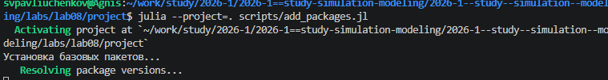{#fig-001 width=70%}

 Создаю и запускаю базовый скрипт SIR_des.jl. Я получаю график, хороший, описывающий модель.  ([рис. @fig-002]).

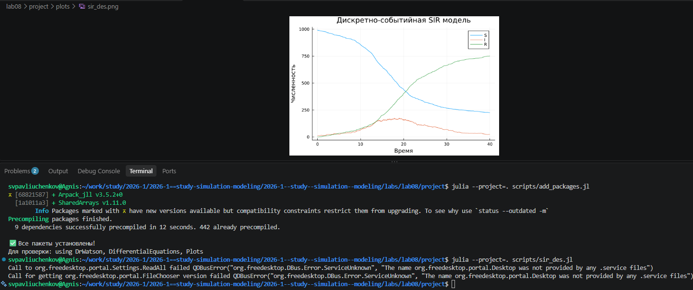{#fig-002 width=70%}

 Мы добавляем варирование параметров и запускаем наш цикл, получая в итоге порядка 20 графиков. ([рис. @fig-003]).

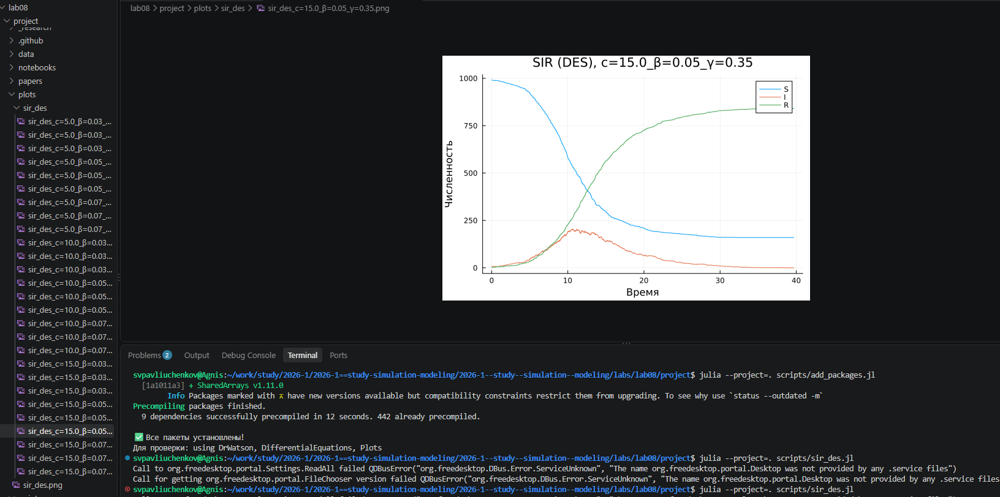{#fig-003 width=70%}



 Заменяем Экспоненциальное на детерминированное распределение в функции live  ([рис. @fig-004]).

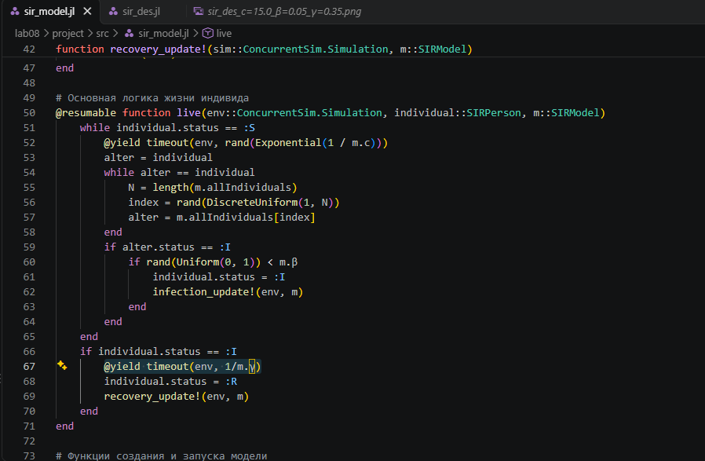{#fig-004 width=70%}

 После чего добавляем вывод результатов в CSV-файл. ([рис. @fig-005]).

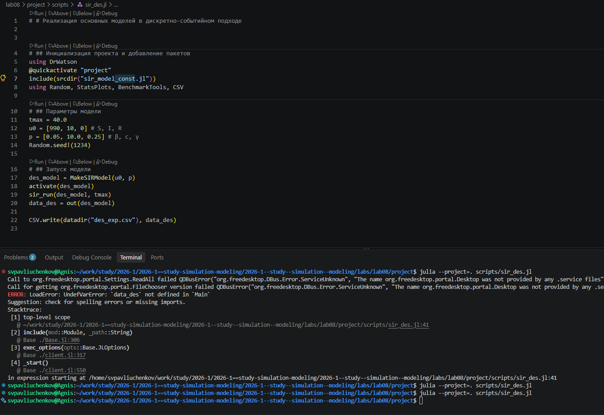{#fig-005 width=70%}

Получаем два результата: с новой функцией live и со старой функцией live, и строим график с объединенными результатами из полученных данных в csv-файлах.график, показывающий разницу между экспоненциальной гаммой и фиксированной  ([рис. @fig-006]).

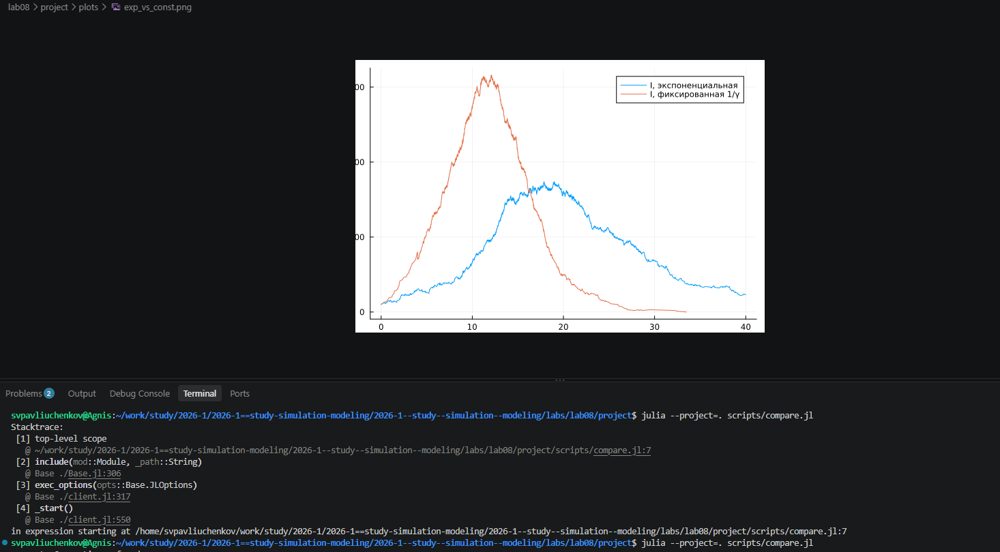{#fig-006 width=70%}

 Добавляем benchmark, который показывает среднее время выполнения одного цикла. ([рис. @fig-007]).

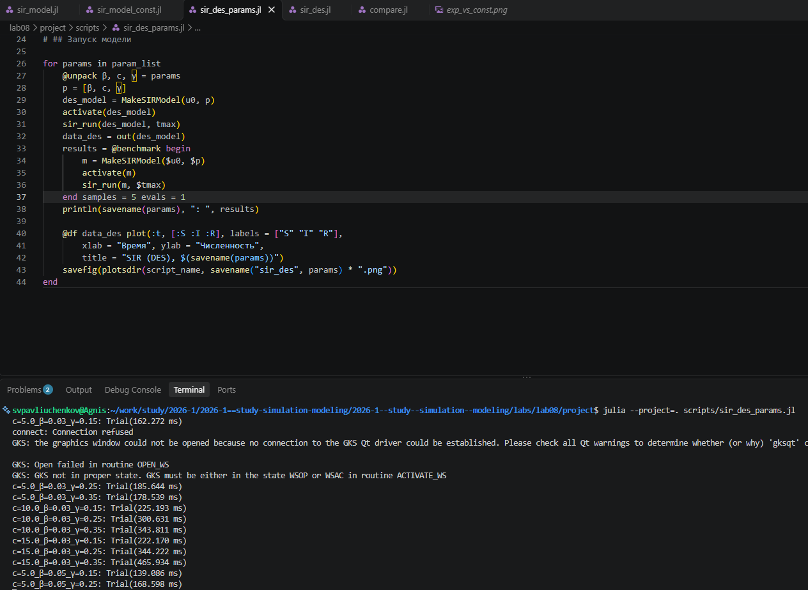{#fig-007 width=70%}

добавляю автоматическое сохранение итоговой таблицы в каталог data/sims ([рис. @fig-008]).

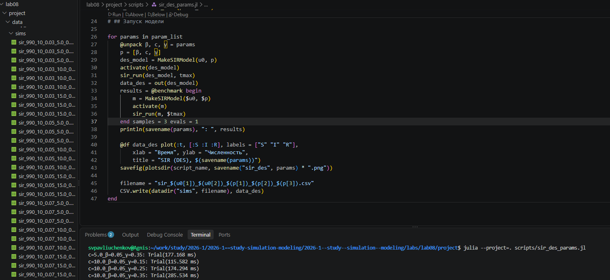{#fig-008 width=70%}

 Добавляем новый параметр, отвечающий за потолок ожидания смерти. После чего, генерируем новые данные и строим графики. ([рис. @fig-009]).

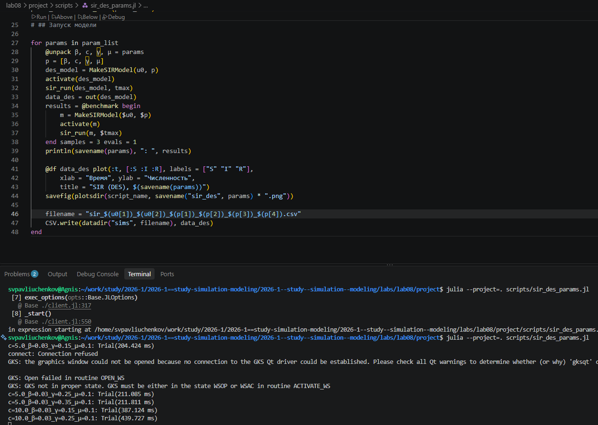{#fig-009 width=70%}



 Реализуем стратегию вакцинации, в определенный мом время, запускаем её и получаем результаты. Оптимальным количеством вакцинированных, лежит в районе 45-55%. ([рис. @fig-010]).

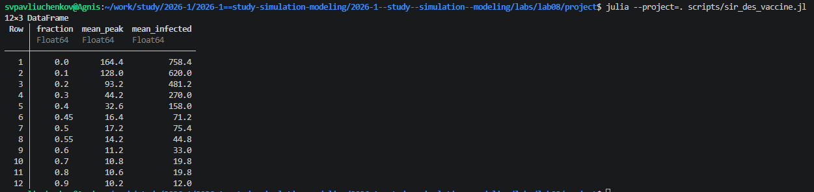{#fig-010 width=70%}



 Добавляем латентный период, обозначающийся буквой Е. Строим график, показывающий влияние параметра омеги, который и был распределен с Е экспоненциально.  ([рис. @fig-011]).

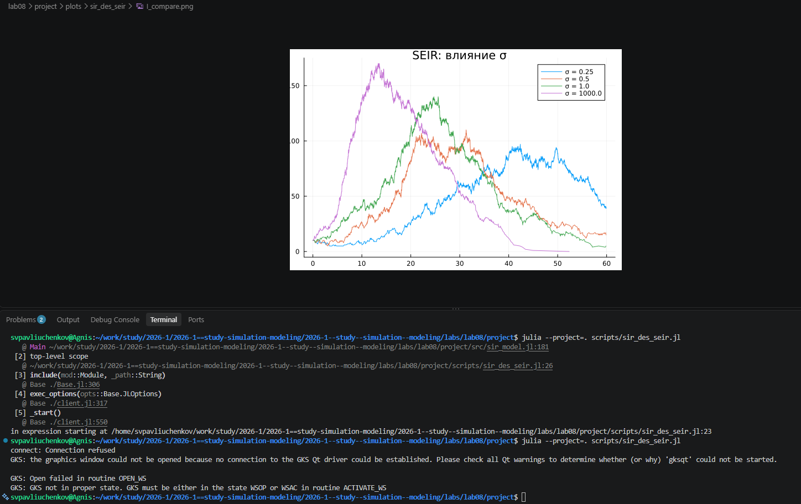{#fig-011 width=70%}

 Вот сейчас создаем производные файлы для всех скриптов и запускаем в этом случае один с бенчмарком. Получаем, что из 10 000 результатов с 5 оценками для одного мы получили среднее время 6,9 мс, медианное 7,1 мс. Ледня: память заполнена на 394 байта. ([рис. @fig-012]).

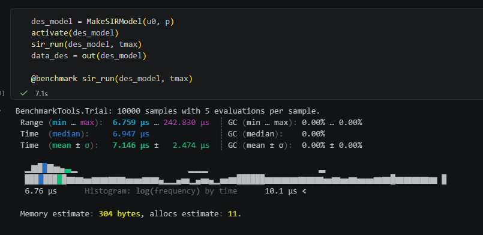{#fig-012 width=70%}

 Запускаем повторное вычисление sir_des_vaccine.ipynb, но теперь слегка сдвинул начало вакцинации([рис. @fig-013]). Учитаем, что теперь оптимальное значение лежит в районе 60-70%. 

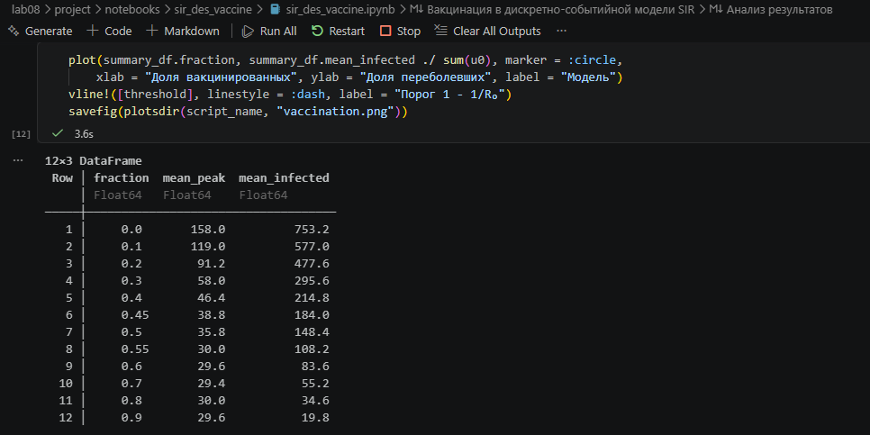{#fig-013 width=70%}

 Запускаю финальное вычисление со всеми новыми параметрами в sir_params.py([рис. @fig-014]).
 Получаем новые графиков, которые будут ниже. 
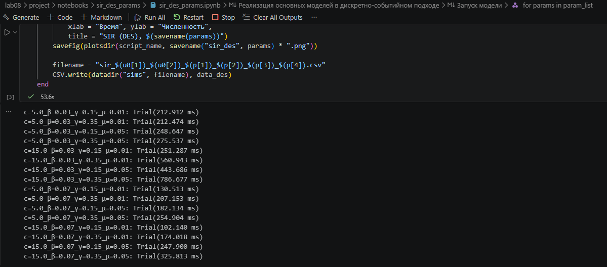{#fig-014 width=70%}



# Выводы

В лабораторной работе мы изучили дискретно-событийный подход к итерационному моделированию на примере модели SIR. Реализована стохастическая дискретно-событийная модель на julia, проведены анализ влияния параметров, сравнение стохастической и детерминированной длительности болезни и оценка производительности, а модель расширена до SEIR.